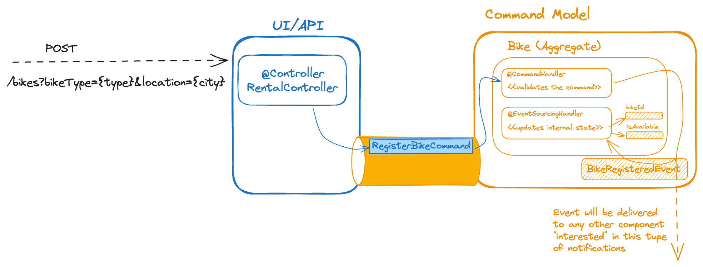

:toc: left
:toclevels: 5
:sectnums:
:stem:
:source-highlighter: coderay

= 新しいバイク機能の作成を実装する

このチュートリアルのステップでは、最初の機能である新しいバイクの作成（または登録）をシステムにサポートする手順を実装します。

== 設計の考慮事項

コードを書き始める前に、まずシステム設計の全体像を紹介し、後で分割および拡張できるように準備しましょう。
レンタルモジュールに取り組むつもりですが、*モジュラー モノリス* として構築したいと考えています。そのためには、以下の設計目標を念頭に置く必要があります。

* *コンポーネントの責任に基づく論理モジュール*: システム内の責任に応じてグループ化します。次の論理モジュールを特定します。

** *UI/API*: ユーザーや外部アプリケーションからのリクエストを直接受けるコンポーネント。REST API を使用してアプリケーションのインターフェイスを実装します。
** *コマンド モデル*: 処理の結果、システムの状態が変更されるすべてのリクエストを受け取るコンポーネント。例えば、「新しいバイクを登録する」、「バイクを借りる」、「バイクを返す」などのリクエストはコマンドの一例です。
** *クエリ モデル*（*プロジェクション* とも呼ばれます）: 情報（またはクエリ）のリクエストを処理するコンポーネントで構成されます。できるだけ迅速に応答するために、これらのコンポーネントはシステム内のデータをユーザーが期待する応答形式に近い形で保持します。たとえば、アプリケーションがすべてのバイクリストとその利用可能な状態を取得するリクエストをサポートする必要がある場合、コンポーネント（プロジェクション）はすべてのバイクとその状態を最新の状態で保持し、リクエスト時にすぐに返す準備をします。

* コンポーネントの *疎結合*: *メッセージ*（コマンド、イベント、クエリなど）を使用して異なる論理モジュール間で通信します。
* *場所の透明性*: メッセージを届けるために他のコンポーネントに到達する手段の具体的な詳細に対処する必要がないようにする抽象化に依存したいと考えています。例として、UI（HTTPリクエストを受け取り、適切なコマンドモデルまたはクエリモデルのハンドラに転送する責任を持つ）は、リクエストを処理するための特定のコンポーネントを知る必要がないことが挙げられます。

これらの設計目標を達成するのは難しいように思えるかもしれませんが、正しい種類のメッセージとAxonIQツールに依存すれば、それがいかに簡単であるかがわかります。
まとめとして、レンタルアプリケーションは次の高レベルのアーキテクチャ図を持ち、システムに新しいバイクを登録するリクエスト（および一般的にすべてのリクエスト）を処理します。

image::images/logic-diagram.png[Design diagram with the logical modules for rental application: An UI/API module contains the HTTP Controller that receives the HTTP POST request to register a new bike. The HTTP Controller sends a RegisterBikeCommand to the Command Model module, including a CommandHandler to maintain the Bike aggregates. After processing a RegisterBikeCommand, the CommandHandler sends a BikeRegisteredEvent to the Query Model module, which keeps a Projection with the data stored on a DB. The Projection on the QueryModel also receives and handles a GetBikesQuery that can be sent from another Controller in the UI/API module.]

これらは別々のモジュールにすることができますが、現時点では同じプロジェクト内の論理コンポーネントとして考えます。つまり、同じプロジェクト内で異なるパッケージを定義します（この場合は `rental` モジュール）。

== システム内で新しいバイクを登録するプロセスの実装

:needs-improvement: メッセージの種類とコマンドメッセージが何であるかの参照を追加します。

アプリケーションがバイクを作成するリクエストを受け取ると、アプリケーションの状態が変わることを意味します。処理が成功した後、システムには新しいバイクが追加されます（利用可能なバイクリスト-アプリケーションの状態-が変更される）。したがって、このリクエストを `Command` としてモデル化します。我々の場合、これを `RegisterBikeCommand` と呼びます。

この `RegisterBikeCommand` は `Command Model` にルーティングされます。そこでハンドラメソッドを実装して処理します。このメソッドはシステム内に新しい `Bike` を作成し、変更に関心のある他のコンポーネントに「新しいバイクが登録された」という通知を送信する必要があります。
このメッセージの種類は、*何かが発生したという通知* に対応しており、`Event` として定義されます。したがって、コマンドハンドラは `BikeRegisteredEvent` をトリガーします。

我々の設計で覚えておくべき最後にして重要なことは、システム内でバイクを作成するコードと変更を通知するイベントを発火させるコードの実装順序です。

anchor:design-command-handler[]アプリケーションでは、イベントソーシングの設計目標を守りたいと考えており、それは、他のコンポーネントと同様に `BikeRegisteredEvent` を処理することで、コマンドモデルの変更が行われることを意味します。これにより、イベントのリストがシステムの *唯一の真実の源* となります。

:needs-improvement: イベントソーシングが何を意味し、その利点に関するより詳細なレビューへの参照を追加します。

`RegisterBikeCommand` のコマンド処理を実装する手順は次のとおりです。

1. `@CommandHandler` でコマンドを受け取って検証します。
2. 有効であれば、`@CommandHandler` から `BikeRegisteredEvent` を送信します。
3. `@EventSourcingHandler` を使用して、コマンドモデルで `BikeRegisteredEvent` を登録して受け取ります。
4. コマンドモデルの `@EventSourcingHandler` 内でバイクを作成し、作成されたバイクの詳細を割り当てます。

以下のセクションでは、これらのステップそれぞれを詳細に実装する方法を見てみましょう。

=== コマンドの定義

モジュールを疎結合に保つことを目指しているため、将来アプリケーションが複雑になり、複数のシンプルなモジュールにスケールアウトする必要がある場合でも、容易にモジュール分割できるように、使用するメッセージの定義を `core-api` モジュールに保存しておくことが良い考えです。

したがって、`core-api` モジュールに新しい `CreateBikeCommand` を作成します。 `io.axoniq.demo.bikerental.coreapi.rental` という新しいパッケージを作成し、その中に以下の `RegisterBikeCommand` を作成します。

[source,java]
.core-api/src/main/java/io/axoniq/demo/bikerental/coreapi/rental/RegisterBikeCommand.java
----
package io.axoniq.demo.bikerental.coreapi.rental;

import org.axonframework.modelling.command.TargetAggregateIdentifier;

public record RegisterBikeCommand(@TargetAggregateIdentifier String bikeId,
                                  String bikeType,
                                  String location) {
}
----

<1> `@TargetAggregateIdentifier` はAxonFrameworkに対して、コマンドを処理する前にIDが `{bikeId}` のバイクを読み込むために `bikeId` 属性を一意の識別子として使用するように指示します。

コマンドを処理するために必要な最小限の情報を含むJavaレコードとして定義しました。

TIP: Javaレコード構造を使用することにより、コマンドに不変性の利点ももたらします。Kotlinのデータクラスを使用してコマンドを定義することもできます。

== コマンドモデルの実装

:needs-improvement: アグリゲートが何であるか、それがDDDとどう関連しているかの説明へのリンクを追加します。

`RegisterBikeCommand` を処理するための次のステップは、そのリクエストを処理する責任を負うコンポーネントを定義することです。例として、DDD設計モデルに従っており、このモデルではシステムの状態をモデル化するために *アグリゲート* の概念に依存しています。そして、Axon Framew 主は `Aggregate` を使用して、特定のメッセージを受け取るときにフレームワークが呼び出すメソッドを（注釈を介して）指定します。

=== アグリゲートクラス（バイク）の作成

したがって、バイクを登録、貸し出し、戻すリクエストの処理に関連するアプリケーションの状態を表すアグリゲート（またはエンティティ）を作成することから始めます。

NOTE: 複雑なシステムでは、コマンドおよびクエリモデルを設計するために、システムがサポートする相互作用と機能の事前分析に基づくいくつかのテクニックがあります。 *イベント ストーミング* および *イベント モデリング* は、システムを分析し、さまざまなコマンド、イベント、クエリ、アグリゲートを抽出するための貴重なテクニックです。

:needs-improvement: これらのブログ記事がaxoniq.ioコーポレートサイトの新しい場所に移動したら、開発者ポータルからのブログ記事へのリンクを追加します。

`Bike` クラスを作成して、アグリゲートをモデル化することから始めましょう。

[source,java]
.rental/src/main/java/io/axoniq/demo/bikerental/rental/command/Bike.java
----
@Aggregate <.>
public class Bike {
    @AggregateIdentifier<.>
    private String bikeId;

    private boolean isAvailable;
    private String reservedBy;
    private boolean reservationConfirmed;

    public Bike() {<.>
    }
}

----
<.> クラスには `org.axonframework.spring.stereotype.Aggregate` 注釈を付けます。これにより、Axon Frameworkは、コマンドモデルコンポーネントが受け取るコマンドおよびイベントに基づいて、バイクのインスタンスのライフサイクルを処理します。
<.> バイクのインスタンスの一意の識別子を保持する属性を、`org.axonframework.modeling.command.AggregateIdentifier` 説明で設計します。
<.> Axon Frameworkがバイクの新しいインスタンスを作成し、そのフィールドを状態で入力する前に、コマンドまたはイベントを処理するメソッドを呼び出すため、デフォルトのJavaコンストラクタも必要です。

=== コマンドハンドラメソッドの定義

アプリケーションで `RegisterBikeCommand` を処理するには、コマンドを引数として受け取るメソッドを `Bike` クラスに定義する必要があります。コマンドを受け取った際にそのメソッドを呼び出すように指示するため、Axon Frameworkが提供する `@CommandHandler` 注釈を追加します。

この場合、`RegisterBikeCommand` はバイクの新しいインスタンスを作成するリクエストであるため、コンストラクタを使用してコマンドハンドラを定義する必要があります。

[source,java]
----
@Aggregate
public class Bike {
    @AggregateIdentifier
    private String bikeId;

    private boolean isAvailable;
    private String reservedBy;
    private boolean reservationConfirmed;

    public Bike() {
    }

    @CommandHandler<.>
    public Bike(RegisterBikeCommand command) {<.>
        var seconds = Instant.now().getEpochSecond();
        if (seconds % 5 ==0) {
            throw new IllegalStateException("Can't accept new bikes right now");
        }

        apply(new BikeRegisteredEvent(command.bikeId(), command.bikeType(), command.location()));<.>
    }
}

----
<.> `org.axonframework.commandhandling.CommandHandler` 注釈は、Axon Frameworkにこのメソッドをコマンドの受信時に呼び出すように指示します。
<.> 引数の型は、そのコマンドの種類をAxon Frameworkに示し、どのタイプのコマンドがこのメソッドの呼び出しにリンクされるべきかを示します。
<.> `AggregateLifecycle.apply()` 静的メソッドが呼び出され、システムの状態の変化を通知するイベントを送信されます。この場合、「バイクが登録されました」という通知を行います。

[NOTE]
====
コマンドハンドラ内では、`Bike` インスタンスの内部プロパティは変更していません。
一般的な規則として、`Command Handler design considerations` で議論したように、次の手順に従います。
1. 受け取ったコマンドが有効であり、処理可能であることを検証します（必要に応じて）。
2. コマンドが有効であるためバイクが登録されたことを通知するメッセージを送信します。
新しく登録された `Bike` インスタンスのプロパティを設定する作業は、後のステップで、コマンドモデルが `BikeRegisteredEvent` の受信に反応する際に行います。
====

=== アグリゲートでのBikeRegisteredEventの処理

:needs-improvement: ここでイベントソーシングとその利点に関する詳細な参照が必要です。

システムを *イベントソーシング* の原則に従って設計したいと考えており、それはイベントの集合を *唯一の真実の源* として使用して、システム内のコンポーネントの状態を構築または更新することを意味します。
これはつまり、`BikeRegisteredEvent` をコマンドモデル（今回は `Bike` アグリゲート）におけるステートチェンジのトリガーとしても使用することを意味します。
アグリゲート内でイベントに反応するためには、`BikeRegisteredEvent` イベントを引数として受け取るメソッドを追加し、そのメソッドに `@EventSourcingHandler` 注釈を付ける必要があります。

[source,java]
.rental/src/main/java/io/axoniq/demo/bikerental/rental/command/Bike.java
----
@Aggregate
public class Bike {
    @AggregateIdentifier
    private String bikeId;

    private boolean isAvailable;
    private String reservedBy;
    private boolean reservationConfirmed;

    public Bike() {
    }

    @CommandHandler
    public Bike(RegisterBikeCommand command) {
        var seconds = Instant.now().getEpochSecond();
        if (seconds % 5 ==0) {
            throw new IllegalStateException("Can't accept new bikes right now");
        }

        apply(new BikeRegisteredEvent(command.bikeId(), command.bikeType(), command.location()));
    }

    @EventSourcingHandler<.>
    protected void handle(BikeRegisteredEvent event) {<.>
        this.bikeId = event.bikeId();
        this.isAvailable = true;
    }
}
----
<.> `EventSourcingHandler` 注釈により、このメソッドをイベントの受信にリンクするようにAxon Frameworkに指示します。
<.> Axon Frameworkは引数の型を使用してこのメソッドを特定のタイプのイベントにリンクします。

メソッドの実装では、イベントに提供された情報を使用して、最終的にバイクのプロパティ（モデルの状態）を設定します。

NOTE: `EventSourcingHandler` は、コマンドハンドラによるイベント公開の直後に呼び出されます。ただし、将来的には、同じ `bikeId` の以前のすべてのイベントを再生しての更新が必要な場合にも呼び出されます。

CAUTION: `EventSourcingHandler` メソッド内でイベントに対する検証や変更の無効化は行わないでください。イベントの受信とメソッドの呼び出しは、コマンドが既に処理されたことを示します。従って、これらの変更を無視したり拒否したりすることはできません。なぜなら、これらの変更はすでに起こったことだからです。

このステップで、システムに新しいバイクを登録するリクエストを表すコマンドを処理するためのコードが完了しました。

== HTTP RESTコントローラの実装

このセクションでは、システムのUI 層を実装します。 UI 層は、アプリケーションが提供する外部世界とのインターフェースを表します。
例では、いくつかのエンドポイントを提供するRESTサービスインターフェースで開始します。これにより、サードパーティのアプリケーションがシステムを呼び出すことができます。このREST インターフェースは、ユーザーまたは別のシステムからのリクエストを受け入れ、内部で対応するコマンドを作成して送信する方法を示すために便利です。

=== SpringBootコントローラを作成する

コントローラのために、シンプルなSpring `@RestController` を作成し、Axon Frameworkが提供するいくつかのコンポーネントを設定します：

- *`CommandGateway`*: Axon Frameworkが提供する抽象メカニズム。これによりコントローラはシステムに登録されたコマンドハンドラの数や場所を知らずにコマンドを送信できます。
- *`QueryGateway`*: `CommandGateway`と同様の抽象化で、今度はクエリリクエストを配信し、その応答を待つことを目的としています。

[NOTE]
====
現在は `CommandGateway` を使用するだけですが、後でシステムから情報を取得するためのリクエスト処理を実装する際に `QueryGateway` も必要となるため、`@RestController` に追加します。

段階的にコードを実装することを好む場合は、今は `CommandGateway` だけを追加してください。最初のクエリのコードを実装するときに `QueryGateway` フィールドとその初期化を追加できます。
====

これらの2つのコンポーネントの抽象化は、`@RestController` がシステム内のさまざまなクエリハンドラーおよびコマンドハンドラーから分離されるのを助けます。Axon Framework はクエリやコマンドのルーティングと通信パターンの処理に必要な適切な実装を注入します。

したがって、コントローラはハンドラーに関する詳細を追跡する必要がありません。この特性は *Location Transparency*（位置透明性）として知られ、後でアプリケーションを容易にスケールアウトできる機能の1つです。コマンドハンドラーの実装を別のモジュールに移動し、別のマシンにデプロイしても、コマンドを送信するコードを変更する必要がありません。

コントローラを `io.axoniq.demo.bikerental.rental.ui` パッケージに配置します。以下の内容で `RentalController` クラスを作成します。

[source,java]
.rental/src/main/java/io/axoniq/demo/bikerental/rental/ui/RentalController.java
----
@RestController<.>
@RequestMapping("/")<.>
public class RentalController {

    private final CommandGateway commandGateway;<.>
    private final QueryGateway queryGateway;<.>

    private final BikeRentalDataGenerator bikeRentalDataGenerator;

    public RentalController(CommandGateway commandGateway, QueryGateway queryGateway, BikeRentalDataGenerator bikeRentalDataGenerator) {<.>
        this.commandGateway = commandGateway;
        this.queryGateway = queryGateway;
        this.bikeRentalDataGenerator = bikeRentalDataGenerator;
    }

}
----
<.> `@RestController` SpringBoot アノテーションは、このコンポーネントがRESTエンドポイントを定義することを示します。
<.> `@RequestMapping` SpringBoot アノテーションは、このコントローラが処理するすべてのエンドポイントのルートパスを示します。
<.> コマンドを送信するために使用する `CommandGateway`。
<.> 後でクエリリクエストを送信し、その応答を待つために使用する `QueryGateway`。
<.> `CommandGateway` および `QueryGateway` を引数として受け取るコンストラクタを定義します。Axon Framework によって提供された適切な実装がSpringによって提供さます。

=== バイク登録のエンドポイントを実装する

新しいバイクを登録するためのHTTPリクエストを処理するメソッドをコントローラに追加する必要があります。システムで新しいバイクを作成するには、リクエストにバイクの種類と登録される場所を提供する必要があります。

このエンドポイントのリクエストフォーマットは次のようにします:

    POST /bikes?bikeType={bikeType}&location={city}

NOTE: 新しい要素をシステムに登録するRESTエンドポイントを設計するときは、POSTリクエストを使用し、作成するエンティティの情報を本文に含めるのが一般的です。この最初の例では、簡単のためにリクエストのパラメータとしてバイクの詳細を受け取ります。

これらのリクエストを処理するエンドポイントを実装するには、次のメソッドを `RentalController` に追加します:

[source,java]
.rental/src/main/java/io/axoniq/demo/bikerental/rental/ui/RentalController.java
----
@RestController
@RequestMapping("/")
public class RentalController {

    private final CommandGateway commandGateway;
    private final QueryGateway queryGateway;

    private final BikeRentalDataGenerator bikeRentalDataGenerator;

    public RentalController(CommandGateway commandGateway, QueryGateway queryGateway, BikeRentalDataGenerator bikeRentalDataGenerator) {
        this.commandGateway = commandGateway;
        this.queryGateway = queryGateway;
        this.bikeRentalDataGenerator = bikeRentalDataGenerator;
    }

    @PostMapping("/bikes")<.>
    public CompletableFuture<String> registerBike(
            @RequestParam("bikeType") String bikeType,<.>
            @RequestParam("location") String location) {<.>

        RegisterBikeCommand registerBikeCommand =
                new RegisterBikeCommand(<.>
                        UUID.randomUUID().toString(),<.>
                        bikeType,
                        location);

        CompletableFuture<String> commandResult =
                commandGateway.send(registerBikeCommand);<.>

        return commandResult;<.>
    }
}
----
<.> `@PostMapping` はこのメソッドが `POST /bike` リクエストを受信したときに実行されることを示します。
<.> `bikeType` 引数はリクエストの同じ名前のパラメータから抽出されます。
<.> `location` 引数はリクエストのURLから同じ名前のパラメータの値で埋められます。
<.> コマンドモデルでコマンドを送信するために必要な `RegisterBikeCommand` を作成する必要があります。
<.> コマンドはバイクの一意のIDを要求します。このリクエストは新しいバイクの作成を表すため、コントローラで一意のIDを作成することにしました。
<.> コマンドを Axon Framework によって提供される `CommandGateway` 抽象化を介して送信します。
<.> コマンドはコマンドハンドラーにディスパッチされます。それはコマンドの実行結果を含む `CompletableFuture` を返します。

注記: 既定では、Axon Framework は作成されたバイクのIDを返します。コマンドハンドラーにコマンドを配信する際にエラーが発生した場合（例: `RegisterBikeCommand` に対して登録されたコマンドハンドラーがないため）、CompletableFuture はエラーを含みます。

:needs-improvement: "コマンドのルーティングパターンと通信の意味、および AxonFramework がコマンドハンドラーに応じてエラーまたは成功値を返す方法を説明するリンクを追加してください。"

== 結論

このセクションでは、システムに新しいバイクを登録するためのリクエストを処理するために必要なコードを実装しました。

以下の画像は、実装したデザインを表しています。

.新しいバイクを登録するためのメッセージのフローを示す図

アプリケーションを実行して動作を確認できます。次のセクションでは、開発環境からdockerを使用してAxonFrameworkアプリケーション全体を実行する手順を説明します。