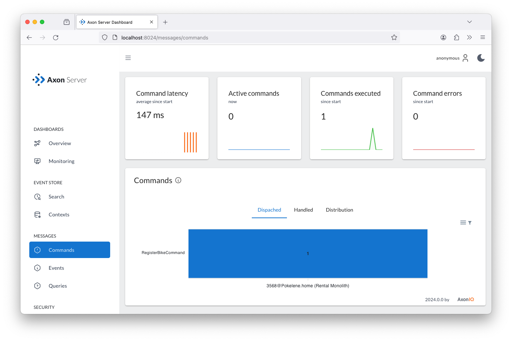
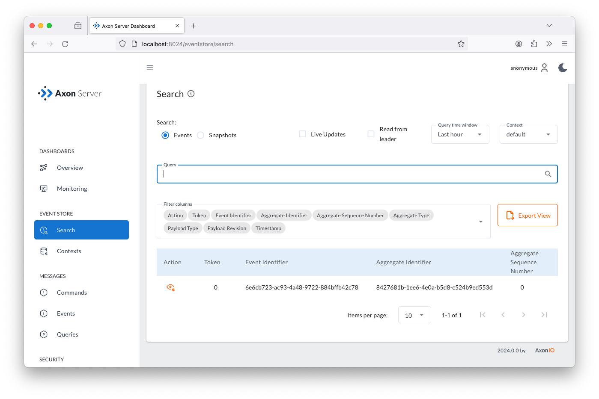

:toc: left
:toclevels: 5
:sectnums:
:stem:
:source-highlighter: coderay

= バイク登録エンドポイントの実行

xref:implement-create-bike.adoc[最初の機能を実装した]ので、xref:run-app-with-docker-compose.adoc[アプリケーションが稼働している] 状態で、バイクを登録するためのエンドポイントを呼び出し、コマンドとイベントの交換を確認します。

== エンドポイントの呼び出し

この機能をテストするために、以下のHTTPリクエストを送信する必要があります。

    POST http://localhost:8080/bikes?bikeType={type}&location={city}

これはコマンドライン、使用しているHTTP RESTクライアント、またはIntelliJ IDEAを使用している場合に簡単にHTTPエンドポイントを実行する方法を説明します。

=== コマンドラインから

コマンドラインからエンドポイントを簡単に呼び出すには、ターミナルで次の `curl` コマンドを入力します。

[,console]
----
> curl -X POST "http://localhost:8080/bikes?bikeType=city&location=Utrecht"
----

このコマンドはエンドポイント呼び出しのレスポンスを表示し、新しいバイクに割り当てられたUUIDが返されます。

NOTE: `POST HTTP` リクエストを送信していますが、この場合ボディリクエストに内容を指定する必要はありません。情報はすべてURLパラメータで指定されています。この方法は`POST`リクエストの推奨設計ではありませんが、簡単な設計のために、必要な情報をURLパラメータで指定しています。

=== IntelliJ IDEAを使用して

IntelliJ IDEAを使用している場合、 https://www.jetbrains.com/help/idea/http-client-in-product-code-editor.html[HTTP Client plugin,role=external,window=_blank] を利用してアプリケーションのすべてのエンドポイントを定義して呼び出すことができます。

`.http` または `.rest` 拡張子のファイルを作成し、システムで呼び出すエンドポイントのURLを追加するだけです。リクエストは三つのハッシュマーク（`\###`）で区切ります。

プロジェクトのルートに `requests.http` というファイルを作成し、次の内容を追加します:

:needs-improvement: change content block to include::example$root/requests.http[tag=registerBike]

[source,httprequest]
./requests.http
----
### Register a new bike
POST http://localhost:8080/bikes?bikeType=city&location=Utrecht
###
----

ファイルを保存すると、IntelliJ IDEAは `POST` URLの行に緑の「再生」ボタンを表示します。 `rental` アプリケーションが実行されている状態でこのボタンをクリックすると、リクエストが送信および実行されます。

[source]
----
POST http://localhost:8080/bikes?bikeType=city&location=Utrecht
HTTP/1.1 200 OK
Vary: Origin
Vary: Access-Control-Request-Method
Vary: Access-Control-Request-Headers
Content-Type: text/plain;charset=UTF-8
Content-Length: 36
8427681b-1ee6-4e0a-b5d8-c524b9ed553d
Response code: 200 (OK); Time: 591ms (591 ms); Content length: 36 bytes (36 B)
----

== Axon Serverでバイク登録リクエストの実行を確認する

エンドポイントを呼び出した後、アプリケーションがリクエストをどのように処理し、どのようなメッセージが送信されたかを確認できます。
これを行うには、Axon Serverダッシュボードを使用します。まず、ブラウザで以下のURLを開きます:

    http://localhost:8024/

Axon Serverダッシュボードが表示され、`Rental Monolith` アプリケーションが接続されていることがわかります。

image::images/AxonServer-Dashboard.png[Axon Serverダッシュボードのスクリーンショット、Rentalアプリケーションが接続されているAxon Serverインスタンスを表示]

=== コマンドの確認

左側のパネルで `Commands` ボタンをクリックします。アプリケーションによって登録されたすべてのコマンドハンドラが表示され、この場合は `RegisterBikeCommand` だけです。

パネルには、`Rental Monolith` アプリケーションによって1つの `RegisterBikeCommand` がシステムに受信され処理されたことも表示されます。これは `RentalController` が作成し、`CommandGateway` を通じて送信されたコマンドに対応します。

=== イベントの確認

コマンドハンドラを実装する際に、コマンドを検証し、システム内の他のコンポーネントに変更を通知する `BikeRegisteredEvent` を送信しました。

このイベントが送信されたかどうかを確認するには、Axon Serverダッシュボードの左メニューの `Search` ボタンをクリックします。この操作により、Axon Serverで送信および保存されたすべてのイベントを検索するページが表示されます。

`Query` フィールドに何も指定せずに（空のままにして）右側の虫眼鏡ボタンをクリックします。コマンドハンドラを実行した結果として送信された唯一のイベントがテーブルに表示されます:

イベントの行の `Action` 列の目のアイコンをクリックすると、イベントの詳細が表示されるポップアップパネルが表示されます。

image::images/AxonServer-BikeRegisteredEvent-details.png[Axon Serverのイベント検索ページのスクリーンショット、BikeRegisteredEventの詳細を表示]

これにより、システムが新しいバイクを登録するリクエストを受信し、適切なコマンドを作成して送信し、そのコマンドを処理した結果として `BikeRegisteredEvent` を作成、送信および保存したことが確認できます。

この最後の `BikeRegisteredEvent` は、このタイプのイベントを受信するように登録されている任意のコンポーネント（クエリモデル内の任意のプロジェクションなど）で再利用されます。また、コマンドモデルは `Bike` エンティティを再構築（または更新）するために `BikeRegisteredEvent` を使用します。

=== 結論

Axon Serverが提供する情報のおかげで、送信されたコマンド、イベント（およびクエリ）の内容を簡単に確認できます。これは、システムが異なるモジュール間で交換するメッセージを確認するのに役立ちます。

ただし、毎回これらの手動チェックを行わなくても済むように、ユニットテストの形式でいくつかの自動テストを持ちたい場合もあります。

次のセクションでは、コマンドハンドラがコマンドを正しく処理することを保証するために、Axonでテストケースを書く方法について学びます。

xref:unit-testing-commands.adoc[テストケースを書く方法] について学びます。